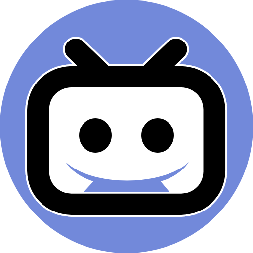

<p align="center">
    
</p>

<h1 align="center">
    Bili Bot
</h1>

<p align="center">
<a align="center" href="https://www.bilibili.com"></a>
<a align="center" href="https://discord.js.org"></a>
</p>

<h3 align="center">
A Discord bot that plays from BiliBili
</h3>
<p align="center">*Forked from <a href="https://github.com/JyaouShingan/bili-bot">bili-bot</a></p>

## Installation
### 1. Install `NodeJs` version >= v16.6.x
### 2. Install `FFMpeg` library

On macOS:
```
brew install ffmpeg
```

On Debian-Linux:
```
apt-get install ffmpeg
```

On Windows:

Refer to https://github.com/m-ab-s/media-autobuild_suite

Make sure ffmpeg executable is in system `PATH` environment variable

### 3. Install and run MongoDB

On macOS:
```bash
brew tap mongodb/brew
brew install mongodb-community
brew services start mongodb-community
```

On Debian-Linux:

Refer to https://docs.mongodb.com/manual/tutorial/install-mongodb-on-debian/

On Windows:

Create a new atlas cluster -> 
- https://www.mongodb.com/cloud/atlas
- https://www.mongodb.com/products/compass

Make sure `mongodb` service is running before starting the bot.

### 4. Install dependency

```
npm install
```

*If Sodium doesn't work, use libsodium-wrappers instead*

## Configuration

Create a file under root directory named `.env`:
```dotenv
DiscordToken=your_token
MONGO_URI=mongodb_url
DB_NAME=database_name
YTApiKey=youtube_API_Key
```

## Run
```
npm start
```

## Further Reading

 - [BiliBili API Collections](https://github.com/SocialSisterYi/bilibili-API-collect)
 - [DiscordJS voice](https://discordjs.guide/voice/)
